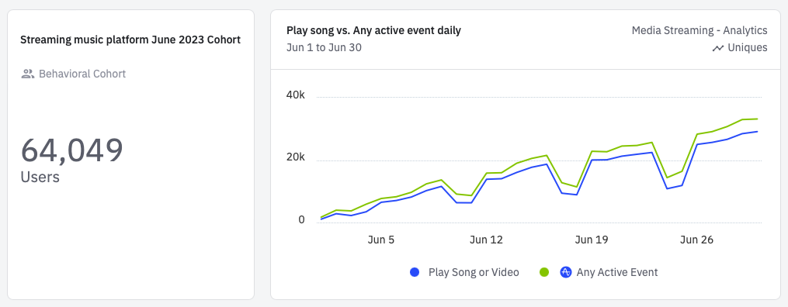
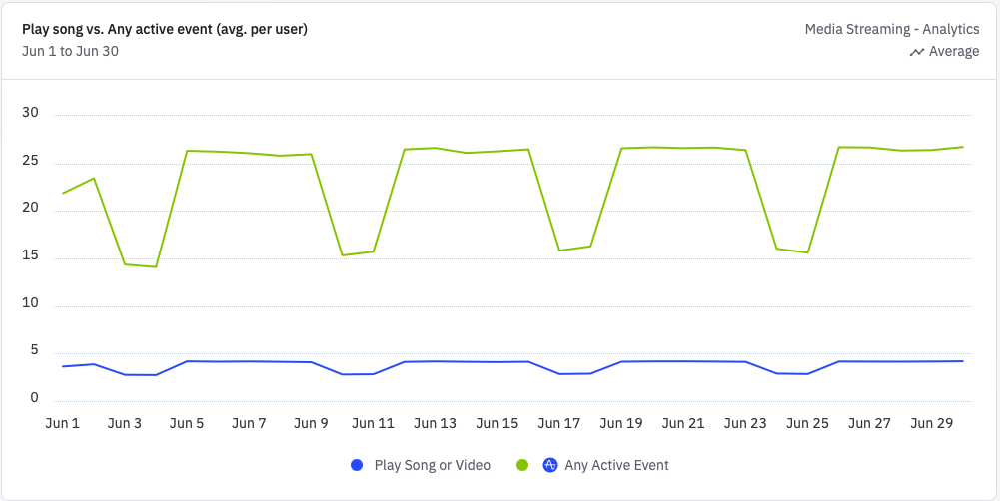
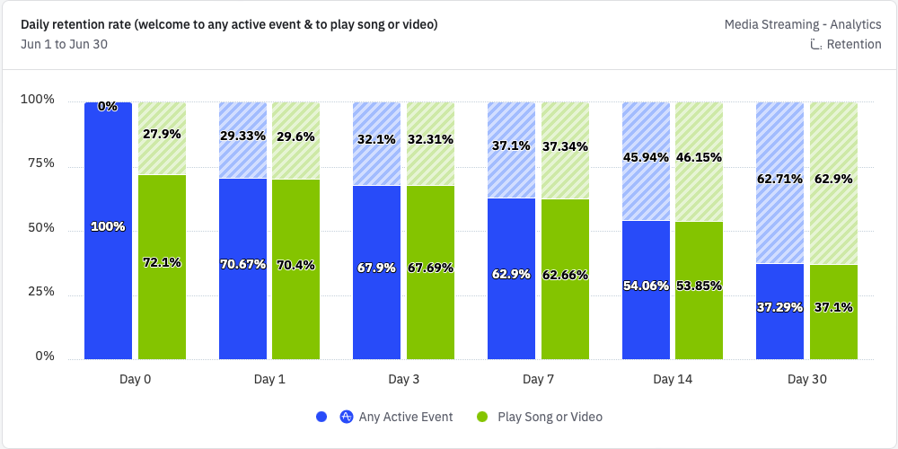
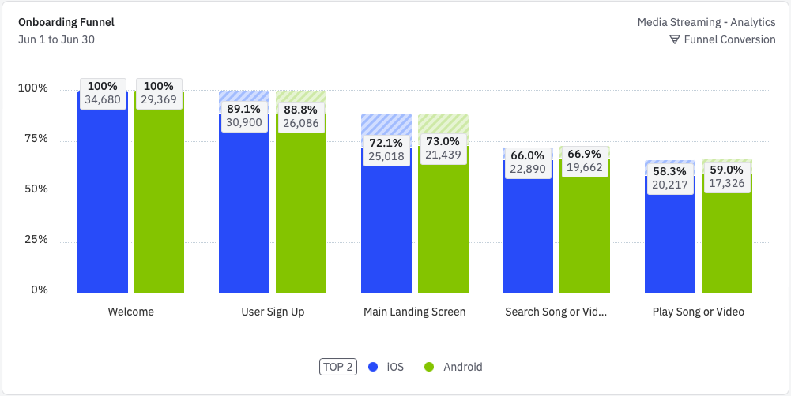
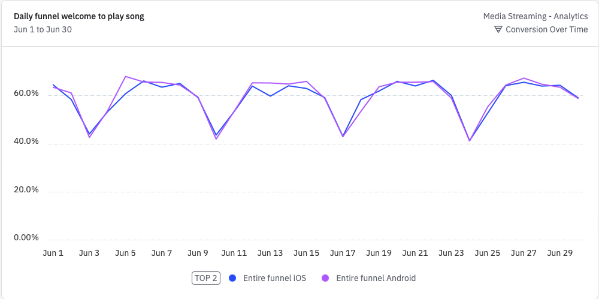
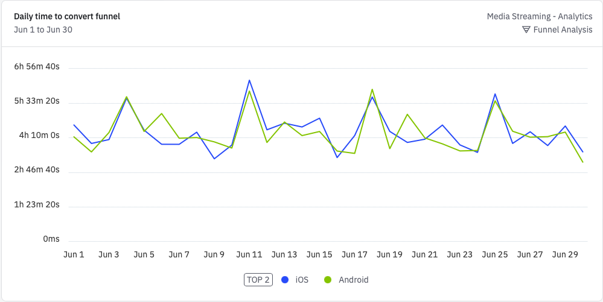

# Music Streaming Platform – Cohort Analysis

This repository presents a **cohort analysis** of users on a music streaming platform, focusing on user retention, engagement, and listening behavior. The goal of this analysis is to understand how users interact with the platform over time, identify trends in activity, and provide insights for improving user engagement.

## Key Focus Areas
- **Activity Trends:** Average user activity and song plays per day.  
- **User Retention:** Percentage of users returning to the platform over time.  
- **Platform Comparison:** Differences in engagement and conversion between iOS and Android users.  
- **Weekend vs Weekday Behavior:** How user behavior changes on weekends compared to weekdays.  
- **Funnel Analysis:** How users progress from onboarding to playing their first song and where drop-offs occur.

---

## Dashboard Charts

### 1. User Activity Over Time (Play song vs. Any active event daily)
 
This chart shows that since the launch of the service, the number of users performing an active action or listening to a song increased throughout June 2023, as interest in the new app grew. On Saturdays and Sundays, the number of active events and song plays generally decreases noticeably. Therefore, it makes sense to take actions to increase user activity on weekends. We also understand that most users who visited the platform were listening to songs.

### 2. Average User Activity
  
This chart demonstrates a stable trend in the average number of song plays and other active events per user. On weekends, the number of users decreases less compared to the number of active actions. In other words, users still visit the platform but show less interest in it on weekends. However, the stable trend in the number of song plays throughout the month indicates that on weekends people may not have the time or desire to search for something new, instead listening to either what the platform recommends or what they had previously selected.

### 3. Daily Retention Rate
  
For this chart, “Return on or after” was chosen instead of “Return on”. This means the chart shows the percentage of users who return either on the day of their first visit to the platform or at any time after their first visit. This option provides a more realistic view of user behavior. Over the course of a month, the platform lost more than 60% of its users. However, the users who remained are more loyal to the service, as the percentage of those performing active actions is almost equal to the percentage of those listening to songs.

### 4. Onboarding Funnel
  
This chart shows that although the difference between the number of Android and iOS users is small, it is noticeable—there are more users on the iOS platform. However, in percentage terms, the conversion rates between the two platforms are almost the same. Therefore, there is no need to make changes to the service versions on either of the two platforms.

### 5. Daily Funnel
  
This chart shows that there is no significant difference in user conversion from the beginning of the funnel to playing a song between platforms. It is also noticeable that on Saturdays, users do not complete the onboarding funnel fully, resulting in lower conversion. This also serves as an incentive for the team to add attractive offers or reminders to open the app in order to increase user activity.

### 6. Daily Time To Convert Funnel
  
We can see that the time it takes for users to reach playing a song varies depending on the platform. Again, on Sundays, users need more time to start listening to a song. On Sundays, users are likely occupied with family, household tasks, or walks, having a slower day. They visit the platform out of curiosity rather than with a specific goal. In contrast, weekdays are busier and more dynamic, so users start playing a song more quickly, for example, while commuting or using headphones on the go.

---

## Notes
- Screenshots are taken from the **Amplitude dashboard**.  
